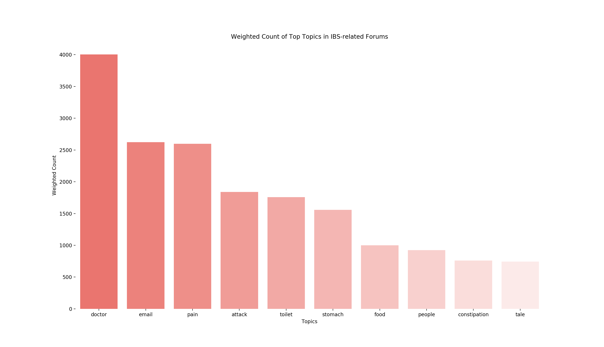
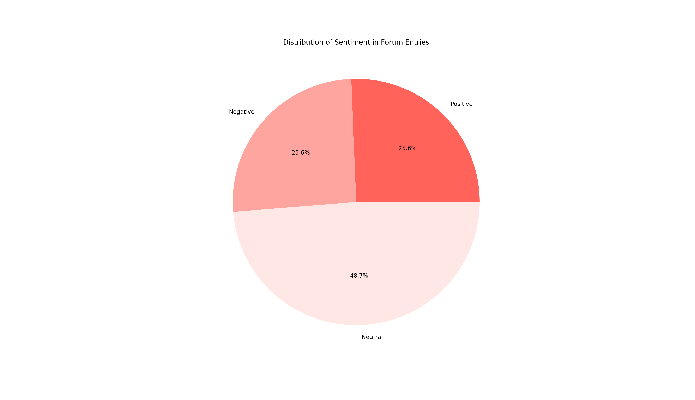

# Forum Data Analysis Report

> By Will Davis (twd38@cornell.edu) and David Hachuel (dh649@cornell.edu)

**All code is available at https://github.com/dhachuel/gi_forum_data_exploration**

## Data Sources

For this assignment, we focus on analyzing data on patients with Irritable Bowel Syndrome (IBS). To do so, we scraped the main IBS-related forums: IBS Tales (https://www.ibstales.com/), IFFGD (https://www.iffgd.org), and About IBS (https://www.aboutibs.org). You can find the scraping code in the `forum_scraping.py` file. 

## Processing

To extract valuable information from the unstructured IBS patient reports, we used an external API for two main tasks: topic modeling/extraction as well as sentiment analysis. You can find this code in the `forum_analysis.ipynb` file. 

## Visualizations

Finally, we visualize the results using the following script `data_analysis.py`.

